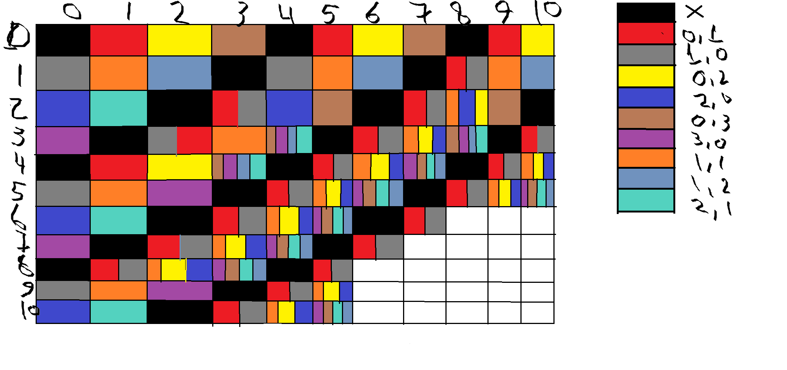

# threeRocksGame
A Solution to Coursera's Algorithmic-Toolbox Three Rocks Game

## How it started

I started constructing a 2D Heatmap of the possible moves that will make me win


A Table version of the map

|  # |     0    |     1    |     2    |     3    |     4    |     5    |     6    |     7    |     8    |     9    |       10      |
|:--:|:--------:|:--------:|:--------:|:--------:|:--------:|:--------:|:--------:|:--------:|:--------:|:--------:|:-------------:|
|  0 |  You Won |    0,1   |    0,2   |    0,3   | You Lost |    0,1   |    0,2   |    0,3   | You Lost |    0,1   |      0,2      |
|  1 |    1,0   |    1,1   |    1,2   | You Lost |    1,0   |    1,1   |    1,2   | You Lost |    1,0   |    1,1   |      1,2      |
|  2 |    2,0   |    2,1   | You Lost |    0,1   |    2,0   |    0,3   | You Lost |    1,0   |    1,1   |    0,3   |    You Lost   |
|  3 |    3,0   | You Lost |    1,0   |    1,1   |    3,0   | You Lost |    1,0   |    1,1   |    0,3   | You Lost |      1,0      |
|  4 | You Lost |    0,1   |    0,2   |    0,3   | You Lost |    1,0   |    1,1   |    0,3   | You Lost |    1,0   |      1,1      |
|  5 |    1,0   |    1,1   |    3,0   | You Lost |    1,0   |    1,1   |    0,3   | You Lost |    1,0   |    1,1   |      0,3      |
|  6 |    2,0   |    2,1   | You Lost |    1,0   |    1,1   |    3,0   | You Lost |    1,0   |    1,1   |    0,3   |    You Lost   |
|  7 |    3,0   | You Lost |    0,1   |    1,1   |    3,0   | You Lost |    1,0   |    1,1   |    0,3   | You Lost |      1,0      |
|  8 | You Lost |    0,1   |    0,2   |    3,0   | You Lost |    1,0   |    1,1   |    0,3   | You Lost |    1,0   |      1,1      |
|  9 |    1,0   |    1,1   |    3,0   | You Lost |    1,0   |    1,1   |    0,3   | You Lost |    1,0   |    1,1   |      0,3      |
| 10 |    2,0   |    2,1   | You Lost |    1,0   |    1,1   |    0,3   | You Lost |    1,0   |    1,1   |    0,3   | Not Your Move |

from the Table or the image you can see the pattern now

but that is a programming assignment XD, so it was about time to code it in python

the python code is divided into four steps.

### Step 1: Creating the board

- Create a set of all possible legal moves

```python
legalMoves = {(1, 0), (0, 1), (1, 1), (2, 0), (0, 2), (3, 0), (0, 3), (1, 2), (2, 1)}
```

- Create a dictionary of tuples to empty strings i.e. {(10, 0): ''} is interpreted as 10 rocks on the right deck and zero rocks in the left deck.

```python
board = {(i, j): '' for i in range(0, 11) for j in range(0, 11)}
```

- Initializing the legalMoves places as a game won i.e. if it is your move and the remaining on board is a legal move, then you won.

```python
board[(0, 0)] = "lost"

for couple in legalMoves:
    board[couple] = 'win'
```

### Step 2: Filling the status of every board state

Now I want to work from the bottom up, giving the rest of the tuples dictionary a status (win or lose). If it's my move and there is no one legal move that can make me get a lose board, (i.e. to give the computer unwinnable state of the board and make me win), then I would give it lost state
otherwise I will give it win status

```py
for i in range(11):
    for j in range(11):
        if (i, j) in legalMoves:
            continue
        for move in legalMoves:
            if tuple(np.subtract((i, j), move)) in board:
                if board[tuple(np.subtract((i, j), move))] == 'win':
                    board[(i, j)] = 'lost'
                elif board[tuple(np.subtract((i, j), move))] == 'lost':
                    board[(i, j)] = 'win'
                    break
```

the reason why I break after the first win is that it's one way of winning I need nothing more.

If it's a lose sitiuation, it might not be a loss after all and other move could give me a win

### Step 3: Create the fuction that takes the computer move and give you a winning move

this function takes the computer move and the current board as tuples

and then iterrate over the legalMoves to find a lose sitiuation, once it finds it, it returns the move and the resulting board.

In case you didn't follow the steps from the start, you may not find a lose sitiuation and thus returning -1

```py
def getNextStep(computerMove: Tuple[int, int], boardState: Tuple[int, int] = (10, 10)) -> Tuple[Tuple[int, int], Tuple[int, int]]:
    boardState = tuple(np.subtract(boardState, computerMove))

    if board[boardState] == 'lost':
        return ((-1, -1), boardState)
    else:
        for move in legalMoves:
            if tuple(np.subtract(boardState, move)) in board:
                if board[tuple(np.subtract(boardState, move))] == 'lost':
                    boardState = tuple(np.subtract(boardState, move))
                    return (move, boardState)
    return ((-1, -1), boardState)
```

### Step 4: Create Main Routine

- Get Initial input from the user, as the board is (10,10) and suggest the next move and get the current board state

```py
(nextMove, currentBoard) = getNextStep(computerMove)
print(f"Your Next game should be ({nextMove[0]}, {nextMove[1]})\n")
```

- start a while loop that is going to iterate until game is done by either winning (following the steps) or losing by not following the steps

```py
while(True):
computerMove = tuple(map(lambda x: int(x), input("Enter Computer move as x y: ").split()))
(nextMove, currentBoard) = getNextStep(computerMove, currentBoard)

if nextMove[0] != -1:
    print(f"Your Next game should be ({nextMove[0]}, {nextMove[1]})\n")
    if currentBoard == (0, 0):
        print("Congratulations! You won the Game!\n")
        sys.exit(0)
else:
    print("You Lost the Game! If you followed the steps correctly and still lost, please debug the code and make a PR\n")
    sys.exit(0)
```